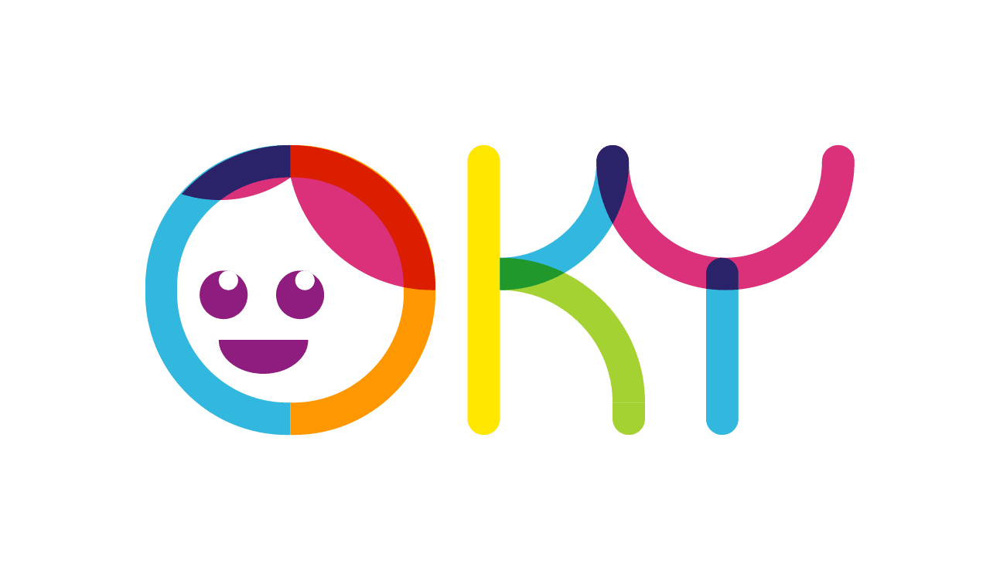

   

  <h1 style="font-size: 36px;">Period Tracker</h1>

   

Oky is the world’s first period tracker app for girls and created with girls.

It provides information about menstruation in fun, creative and positive ways, straight into girls’ hands through the tools they use every day – mobile phones.

Oky lets girls feel in control and more confident by tracking their periods, and getting the information that all girls should know. 

**Note:** This is a period tracker application monorepo, consisting of a React Native app, a CMS and an API.
- 
<h2 style="font-size: 24px;">Features</h2>
The features of the period tracker include:  

<ul>
  <li><strong>Calendar</strong>: Your calendar tells you when you can expect your period every month! You can choose different calendar views for the day or the month and get predictions tailored to you. The more you track, the more accurate the predictions of when your next period will be!
</li>
<li><strong>Personalize Oky</strong>: Choose your Oky friend to guide you through the app, and choose your theme to make Oky yours!You can change your Oky friend or theme whenever you like!
</li>
  <li><strong>Encyclopedia</strong>: Knowledge is power!Oky’s encyclopedia has everything you need to know about periods and your body. It’s packed with trustworthy, quality information, all vetted by global health experts.Oky’s encyclopedia also features specific content for girls with disabilities.
</li>
  <li><strong>Daily diaries</strong>: Keep track of how you feel every day to get to know YOU!Plus, get tips to stay healthy and happy, and quizzes to help you learn the fun way!
</li>
  </ul>

[Install Software Dependencies](./docs/dependencies/index.md)

[Set Up the Project](./docs/setup.md)

[Start the Project](./docs/start_project.md)

[Run the project locally](./docs/run_project.md)

[Test the Project](./docs/tests.md)

[Overview of deployment and architecture](./docs/deployment/deployment_overview.md)

[Deploy the Project](./docs/deployment/deployment.md)

[Common Commands, Testing, Tips, and Tools](./docs/misc.md)

---

### Localisation

[Translations](./docs/localisation/translations.md)

[Updating content](./docs/localisation/updating_content.md)

[Lottie & image validation](./docs/localisation/asset_validation.md)

---

### Code

[Contributing](./CONTRIBUTING.md)

[Submodules](./docs/modules.md)

[Importing optional submodules](./docs/code/optional_submodules.md)

[Understanding the CMS & API routes](./docs/code/routes.md)

[Recommended reading for developers](./docs/code/recommended_reading.md)

